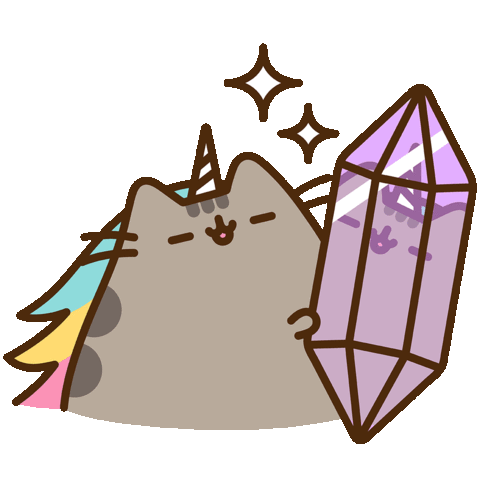

<!-- Start of Icon -->

  

<!-- End of Icon -->

<!-- Start of Introduction -->

    
  

<!-- End of Introduction -->

<!-- Start of Social Media -->

  &ensp;
  &ensp;
  

  
<!-- End of Social Media -->

<!-- Start of GitHub Stats -->

  &ensp;

  

  <!-- Light Mode -->

<!-- End of GitHub Stats -->
